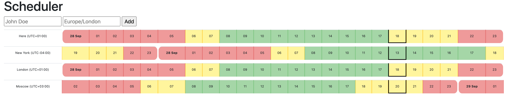

# NodeConf Remote 2020 Workshop: Timezone assistant

_This repository contains support material for the NodeConf Remote 2020 Workshop_

## Menu

- [Rationale](#rationale)
- [Timezone assistant](#timezone-assistant)
- [Prerequisite](#prerequisite)
- [Quick start](#quick-start)
- [Solutions](#solutions)
- [Contributions](#contributions)
- [License](#license)
- [Code of Conduct](#code-of-conduct)
- [Security Vulnerability Reporting](#security-vulnerability-reporting)

## Rationale

If you are coming from the NodeConf Remote 2020 workshop you are in the right place! The instructors will guide you through this repository to get started!

If you are just discovering this workshop, feel free to try out the exercise and peek at the solutions only when you have something done. In this workshop you are expected to use the [temporal proposal](https://github.com/tc39/proposal-temporal) and the [record & tuple proposal](https://github.com/tc39/proposal-record-tuple/) to complete it.

## Timezone assistant

**Book a meeting across time zones!**

We have some users of NodeConf Plc who want to organise a meeting. They're all in different timezones scattered across the world and could use a way of knowing when they're all available.

Can we make use of Temporal to organise when the best time is for them all to meet?

Maybe your app would gain being a bit more immutable, can you try using Record & Tuple to store state?

## Prerequisite

We recommend Node >= v12.0.0 to be installed. The workshop may work on versions below but we don't promise anything!

## Quick Start

Copy the `starter/` directory and run `npm install`/`yarn` in it, then use `npm start`/`yarn start` to start the app. Open the address printed in your terminal and start coding, the server will live-reload so you don't have to restart it.

## Solutions

**If you are participating, please avoid peeking at the solutions unless an instructor directs you to them.**

Solutions are in the `solutions/` directory and you'll have to replace `src/index.js` from the starter with the one in the solution to try it.

## Contributions

We :heart: contributions.

Have you had a good experience with this project? Why not share some love and contribute code, or just let us know about any issues you had with it?

We welcome issue reports [here](../../issues); be sure to choose the proper issue template for your issue, so that we can be sure you're providing the necessary information.

Before sending a [Pull Request](../../pulls), please make sure you read our
[Contribution Guidelines](https://github.com/bloomberg/.github/blob/master/CONTRIBUTING.md).

## License

Please read the [LICENSE](LICENSE) file.

## Code of Conduct

This project has adopted a [Code of Conduct](https://github.com/bloomberg/.github/blob/master/CODE_OF_CONDUCT.md).
If you have any concerns about the Code, or behavior which you have experienced in the project, please
contact us at opensource@bloomberg.net.

## Security Vulnerability Reporting

If you believe you have identified a security vulnerability in this project, please send email to the project
team at opensource@bloomberg.net, detailing the suspected issue and any methods you've found to reproduce it.

Please do NOT open an issue in the GitHub repository, as we'd prefer to keep vulnerability reports private until
we've had an opportunity to review and address them.
